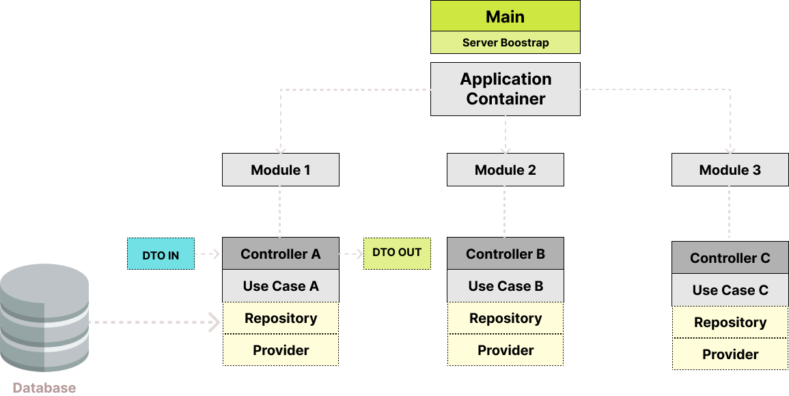
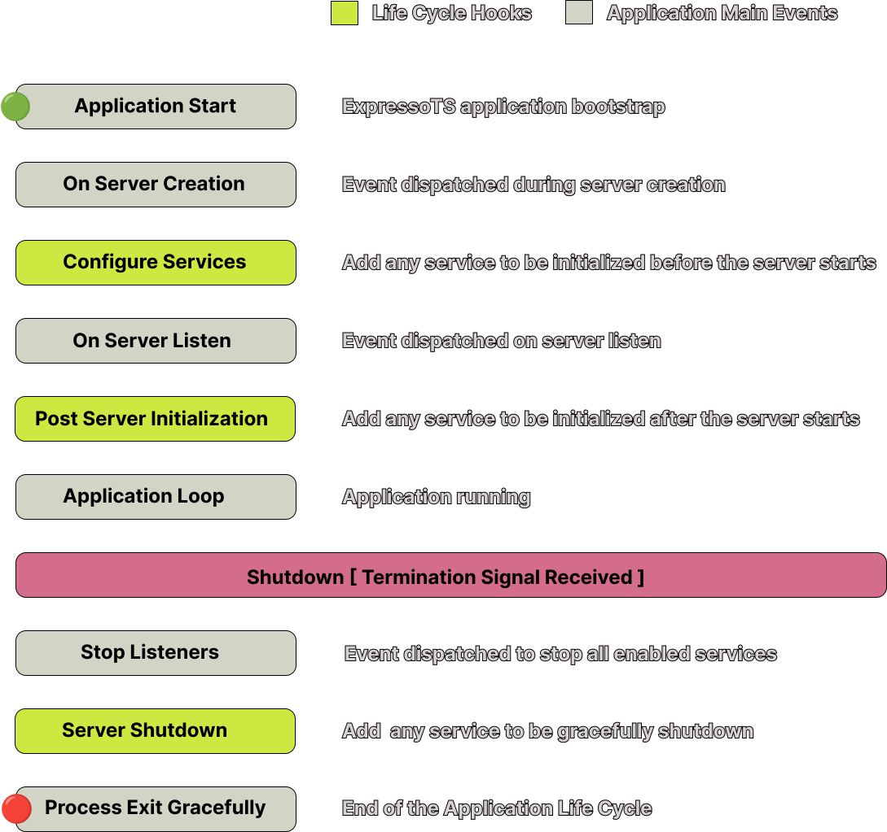

# Application

The Application Overview provides a comprehensive demonstration of the main components of an ExpressoTS application. At the heart of an ExpressoTS application lies the Application class. It serves as the foundation for creating and configuring the server. Additionally, the Application class makes use of the application container from Inversify that loads all the modules, including their respective routes [controllers]. This ensures a streamlined and efficient process for handling incoming requests and delivering the appropriate responses.



ExpressoTS is a web application framework that provides a wrapper around popular HTTP servers, including **[Express](https://expressjs.com)** and **[Fastify](https://www.fastify.io/)**.

:::info
Currently, only Express has been thoroughly tested by the ExpressoTS team. Fastify adapter is a work-in-progress.
:::

The architecture of an ExpressoTS application is built around the **[Inversify](https://inversify.io/)** IoC container, which is used to identify and inject dependencies into class constructors. This approach allows the IoC container to load all the necessary modules, including their respective routes (controllers). By using use-cases and providers as needed, routers can handle incoming requests.

By leveraging the power of Inversify, ExpressoTS provides a custom Dependency Injection system that is scalable and modular. This creates an architecture that helps to decouple components and improve maintainability, allowing developers to focus on writing clean and maintainable code.

## Application Components Breakdown

| Component    | Description                                                                                                                                                                                                                                                                                                                                                                                                                                                |
| ------------ | ---------------------------------------------------------------------------------------------------------------------------------------------------------------------------------------------------------------------------------------------------------------------------------------------------------------------------------------------------------------------------------------------------------------------------------------------------------- |
| DTO IN / OUT | Data transfer object that defines the format of the incoming and outgoing payload of the application.                                                                                                                                                                                                                                                                                                                                                      |
| Controller   | Component responsible for processing requests and responses based on the URL and HTTP method. It also validates the conformity of the incoming data.                                                                                                                                                                                                                                                                                                       |
| Use Case     | Component responsible for implementing the logic required to handle requests received from the controller. When the controller receives an HTTP request and validates the incoming data, it triggers the relevant use case, passing along the validated data for processing. The use case performs the necessary operations based on the request and returns the appropriate response to the controller, which then sends the response back to the client. |
| Provider     | Component responsible for providing external functionality to the application.                                                                                                                                                                                                                                                                                                                                                                             |
| Repository   | Component responsible for providing layer of communication with the database. Facilitating connection and CRUD operations.                                                                                                                                                                                                                                                                                                                                 |

:::info
Providers and Repositories are optional components. You can use them if you need to provide extra functionality to your application such as database integration, logging system, authentication, email etc.
:::

## Workflow

The workflow of an ExpressoTS application is straightforward, as shown in the diagram above.

1. After initializing the application with all its components, including the container, modules, and controllers, the server starts listening for incoming requests.
2. When a request is received, the server looks for the corresponding route and executes the associated controller, which typically exposes endpoints.
3. The controller then calls the relevant use-case, which in turn calls the appropriate provider when required. Providers are external components that offer additional functionality to the application.

:::warning Initializing the Application without a controller
ExpressoTS will prevent you from initializing the Application without a controller since there are no listeners to handle incoming requests. You will see the following message in the console:
**_No controllers have been found! Please ensure that you have register at least one Controller._**
:::

## AppExpress Class

The AppExpress class offers a way to create and configure the server, passing **[Express.js middlewares](https://expressjs.com/en/guide/writing-middleware.html)** or other middleware upon server creation.

To create an ExpressoTS application instance, we use the `AppFactory` class, which is responsible for creating the application instance and initializing the container, modules, and controllers. The `create()` function returns an IApplicationExpress which provides a set of methods to configure the server, including the `listen()` method, which starts the server and listens for incoming requests and `setEngine()`.

### AppExpress Class Definition

```typescript
class AppExpress {
  /**
   * Configure services that should be initialized before the server starts.
   */
  protected configureServices(): void {}

  /**
   * Configure services that should be executed after the server starts.
   */
  protected postServerInitialization(): void {}

  /**
   * Perform actions or cleanup after the server is shutdown.
   */
  protected serverShutdown(): void {}

  public async create() {}

  public async listen() {}
}
```

Also, in the application provider that inherits from AppExpress user can perform conditional logic based on the server environment mechanic provided `isDevelopment()`.

```typescript
if (this.isDevelopment()) {
  // your logic here
}
```

### Create Method

The create method allows developers to pass the container, middlewares and http server adapters to the server. To pass middleware you don't need to use `app.use()`, just pass the middleware and its configuration as demonstrated below:

```typescript
async function Bootstrap() {
  await AppFactory.create(container, [
    express.json(),
    express.urlencoded({ extended: true }),
    cors({
      origin: "*",
    }),
  ]);
}
```

:::info
Adapters are used to create the server. Currently, Express is the only adapter available. Fastify adapter is a work-in-progress.
When you create an application instance, you can pass the adapter as the third parameter. If you don't pass the adapter, Express is used by default.
:::

### Listen Method

The `listen()` method starts the server and listens for incoming requests. In the listen method, developers can define the port number and server environment, which can be either development, staging, or production. Developers can also set the application name and version to be displayed in the console when the server starts, as shown in the following example:

```typescript
// App listen method
app.listen(3000, ServerEnvironment.Development, {
  appName: "Your App Name",
  appVersion: "v1.0.0",
});
```

:::tip
The name and version of your app can be configured via either the .env file or package.json file. In the opinionated template, we use the package.json file to retrieve the app name and version.
:::

### Server Environment Enum

This is an enum that defines the server environment. Currently supported environments are `development` and `production`. Upon server initialization, the underlying framework will look for the NODE_ENV environment variable and set the server environment accordingly. If the NODE_ENV environment variable is not set, the server environment will be set to development by default.

Here are the enum values available for server environments:

```typescript
{
  ServerEnvironment.Development;
  ServerEnvironment.Production;
}
```

## App Class Provider

The App class provider is the heart of the `opinionated template` application. It is responsible for initializing the application and provide functionalities to be configured in the server bootstrapping process. You can make use of the built-in middlewares and providers to configure your application.

```typescript
class App extends AppExpress {
  private middleware: IMiddleware;
  private provider: IProvider;

  constructor() {
    super();
    this.middleware = container.get<IMiddleware>(Middleware);
    this.provider = container.get<IProvider>(Provider);
  }

  protected configureServices(): void {
    this.middleware.addBodyParser();
    this.middleware.setErrorHandler();
  }

  protected postServerInitialization(): void {
    if (this.isDevelopment()) {
      this.provider.envValidator.checkAll();
    }
  }

  protected serverShutdown(): void {}
}
```

The App class provider offers a set of out-of-the-box middlewares and providers that can be used to configure your application. Here is a list of the available middlewares and providers:

### Middlewares

Here are some of the middlewares available:

| Middleware Name  | Description                                       |
| ---------------- | ------------------------------------------------- |
| addBodyParser    | Add body parser middleware to the application.    |
| addCompression   | Add compression middleware to the application.    |
| addCors          | Add cors middleware to the application.           |
| addHelmet        | Add helmet middleware to the application.         |
| addCookieParser  | Add cookie parser middleware to the application.  |
| addCookieSession | Add cookie session middleware to the application. |
| addSession       | Add session middleware to the application.        |
| addServerStatic  | Add static middleware to the application.         |
| addRateLimit     | Add rate limit middleware to the application.     |
| addMorgan        | Add morgan middleware to the application.         |
| addPassport      | Add passport middleware to the application.       |
| setMulter        | Add multer middleware to the application.         |
| addServeFavicon  | Add serve favicon middleware to the application.  |
| setErrorHandler  | Add error handler middleware to the application.  |

### Providers

Here are some of the providers available:

| Provider Name | Description                         |
| ------------- | ----------------------------------- |
| envValidator  | Validate the environment variables. |
| logger        | Add logger to the application.      |

## App Class Lifecycle Hooks

Another important aspect of the Application class is lifecycle hooks. These hooks allow developers to execute code before, after and on server shutdown. It is important to note that in order to take advantage of these hooks, developers must create an App class extending the Application class and override the methods as needed. The following example shows the life cycle hooks available at the moment:

```typescript
    /* Add any service that you want to be initialized before the server starts */
    protected configureServices(): void { }

    /* Add any service that you want to execute after the server starts */
    protected postServerInitialization(): void { }

    /* Add any service that you want to execute after server is shutdown */
    protected serverShutdown(): void { }
```

### Hooks Execution Order



## Application Scripts

Below are the scripts used to run, build and test your application.
The command column shows NPM as the package manager, but you can use your package manager of choice.

| Script     | Description                                     | Command            |
| ---------- | ----------------------------------------------- | ------------------ |
| build      | Build the production bundle in a ./dist folder. | npm run build      |
| dev        | Runs in development watch mode.                 | npm run dev        |
| prod       | Runs in production mode based on built bundle.  | npm run prod       |
| test       | Run your tests located in the test folder.      | npm run test       |
| test:watch | Run your tests in watch and interactive mode.   | npm run test:watch |
| test:cov   | Produces test coverage report.                  | npm run test:cov   |
| format     | Format the code using prettier.                 | npm run format     |
| lint       | Lint code using eslint.                         | npm run lint       |

## Running the Application

```bash
npm run dev
```

Depending on which environment you are running the application in, you will see the following message in the console:

`expressots-demo version 1.0.0 is running on port 3000 - Environment: development`

---

## Support the Project

ExpressoTS is an MIT-licensed open source project. It's an independent project with ongoing development made possible thanks to your support. If you'd like to help, please consider:

- Become a **[sponsor on GitHub](https://github.com/sponsors/expressots)**
- Follow the **[organization](https://github.com/expressots)** on GitHub and Star ⭐ the project
- Subscribe to the Twitch channel: **[Richard Zampieri](https://www.twitch.tv/richardzampieri)**
- Join our **[Discord](https://discord.com/invite/PyPJfGK)**
- Contribute submitting **[issues and pull requests](https://github.com/expressots/expressots/issues/new/choose)**
- Share the project with your friends and colleagues
